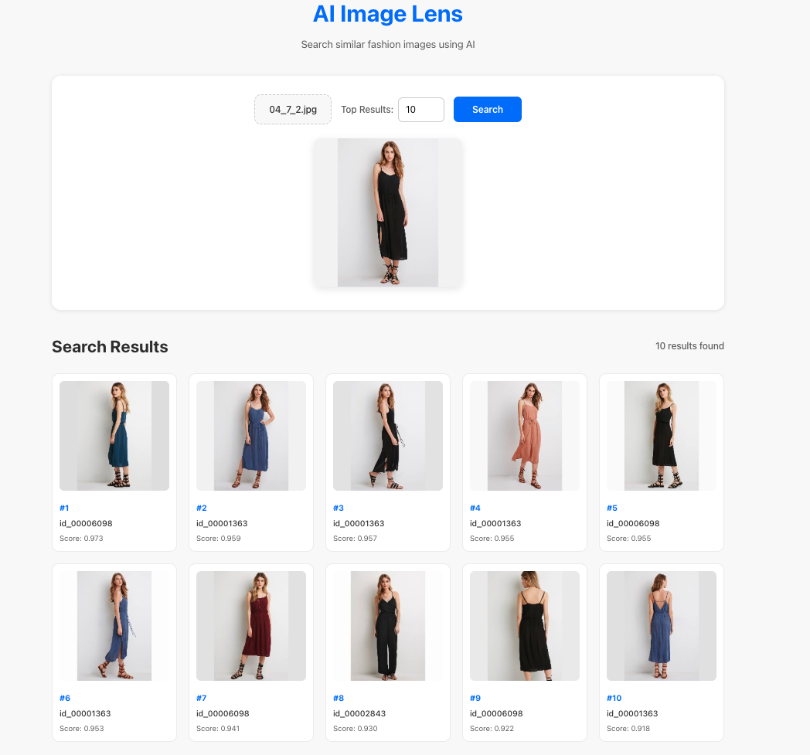
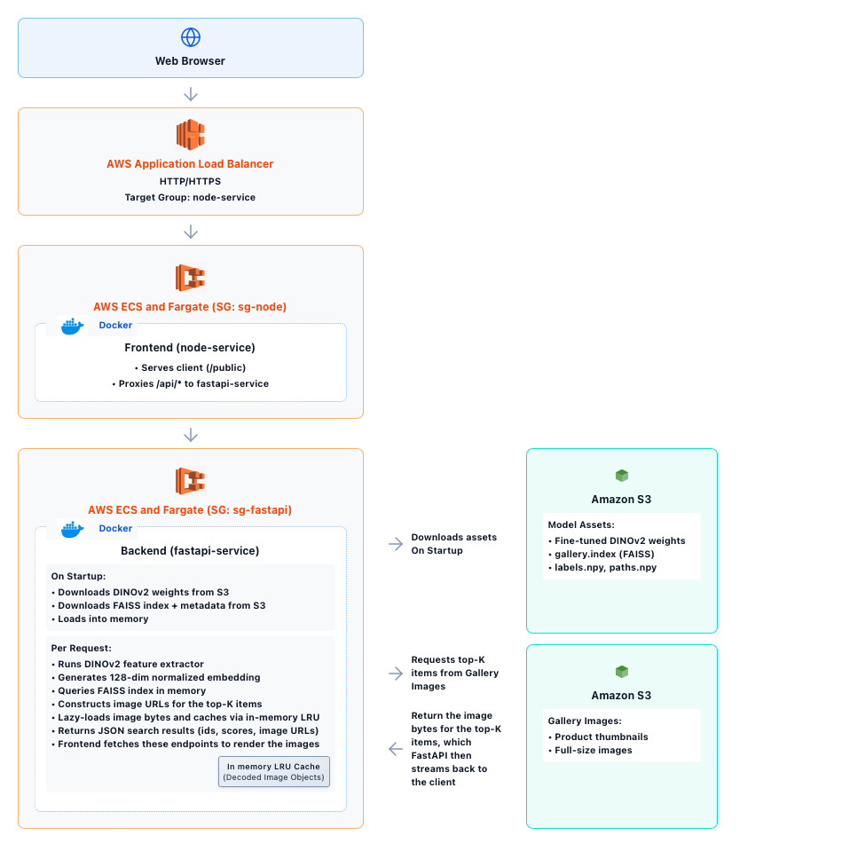
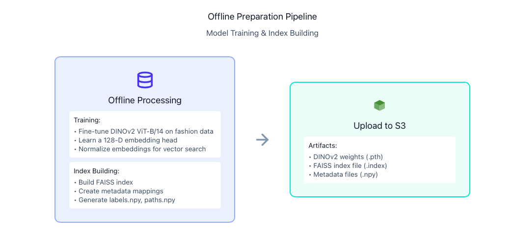

# AI Image Lens

 ## Business problem:
The fashion world has an overload of images (from online stores, social media, and influencers) making it difficult for people to efficiently find visually similar apparel. This project introduces an AI Image-Based Search Retrieval System, allowing users to find similar items by uploading an image rather than typing text.
While Google Lens is excellent for broad searches across the web, this project provides a image retrieval solution tailored to a specific dataset.

 ## Product Search with DINOv2 and FAISS:
 Developed an end-to-end AI Image-Based Search Retrieval that transforms uploaded images into vector embeddings and retrieves similar items with sub-millisecond latency.
 
 ### Model Development: 
 - Model: Achieved state-of-the-art performance by fine-tuning a DINOv2 backbone with a custom 128-D projection head via triplet loss with semi-hard negative mining on ~25k images, utilizing CUDA programming and NVIDIA A100 GPUs to accelerate fine-tuning.

  The fine-tuned model achieves:
 - **~85.6% Recall@1**
 - **~94.42% Recall@5**
 - **~96.5% Recall@10**

 ### Search System: 
 - Vector Search Engine: Implemented FAISS (Facebook AI Similarity Search) to enable sub-millisecond search, supporting query retrieval against a massive index.
 - Backend & API: Developed Python FastAPI service to manage model inference, orchestrate the FAISS search logic, and handle high-volume production requests. FastAPI asynchronous support enabled non-blocking I/O and efficient concurrent request handling, improving throughput and reducing end-to-end latency.
 - Latency Optimization: Achieved near-zero search latency by loading the entire FAISS index into in-memory storage at service startup, completely eliminating slow disk I/O or network hops during query time.
 - Caching & Optimization:
   - LRU Caching: Utilized an LRU cache to keep hot search results in memory. 
   - Lazy Loading: Implemented lazy loading so image data is fetched on demand
- Frontend: HTML, Javascript and CSS
- Deployment: The system is containerized (Docker) and deployed via AWS ECS on Fargate.


## Demo:




## System Architecture
The system has two main parts:
1. Online inference & search: serves the trained model behind a browser UI.
2. Offline training & bundling: Fine-tunes DINOv2 + projection head and builds the FAISS index.


## Online inference & search



- On Startup:
    - FastAPI backend downloads the fine-tuned DINOv2 weights, FAISS index, and metadata from S3 and loads them into memory. This enables high-speed search. 

- Per request (`/api/search-image`):
    - The browser uploads a query image to `/api/search-image`, which is handled by the Node/Express frontend (ECS Fargate) behind the AWS ALB and proxied to the FastAPI service.
    - FastAPI runs the DINOv2 feature extractor and generates a 128-dimensional L2-normalized embedding for the query image.
    - The embedding is used to query the in-memory FAISS index.
    - The backend constructs image URLs and metadata for the top-K items based on the FAISS results.
    - A lazy loader fetches the underlying image bytes (from S3) and caches them via an in-memory LRU cache for subsequent thumbnail requests.
    - FastAPI returns JSON search results (ids, scores, image/thumbnail URLs) to the frontend.
    - The frontend uses these URLs to fetch thumbnails and render the final results grid in the browser.


## Offline Model training  




- **Dataset Details:**
This project uses the **[In-Shop Clothes Retrieval Benchmark](https://mmlab.ie.cuhk.edu.hk/projects/DeepFashion/InShopRetrieval.html)** dataset, which is organized into three logical parts:

   - **train** – images used to learn the embedding model. 
   - **query** – query images used only at evaluation time to calculate retrieval metrics such as Recall@1, Recall@5, Recall@10.
   - **gallery** – catalog images that the system retrieves from. These are used during evaluation (paired with the query split) and also serve as the retrieval database at inference time (when real users search).

- **Backbone & head**
  - Loaded a **pretrained DINOv2 ViT-B/14** backbone.
  - Added a **128-D embedding (projection) head** and partially unfroze the top transformer blocks for fine-tuning.
  
- **Data splits**
  - Used the In-Shop **`train`** split to learn the embedding model.
  - Randomly shuffled all indices and held out **15%** (`VAL_SPLIT_RATIO = 0.15`) as a **validation set**.
  - The remaining **85%** of the `train` split was used as the **training subset**.

- **Batching & loss**
  - Class-balanced batches with **P = 24 classes** and **M = 4 images per class** → **96 images per batch**.
  - Used a **TripletMarginLoss** with **semi-hard negative mining** to learn a metric space for retrieval.

- **Optimization**
  - Optimizer: **Adam** with learning rate **1e-4**.
  - Mixed-precision training via `torch.amp.autocast("cuda")` and `GradScaler`.
  - Learning rate scheduling with **ReduceLROnPlateau** on validation loss (factor **0.1**, patience **3**).

- **Epochs & early stopping**
  - Configured for up to **50 epochs** (`num_epochs = 50`).
  - After each epoch, the model is evaluated on the **validation** subset and the **validation loss** is computed.
  - **Early stopping**:
    - Tracks the best validation loss seen so far.
    - If validation loss **does not improve for 7 consecutive epochs** (`patience = 7`), training stops early.
    - This is to prevent overfitting and unnecessary extra epochs.

- **Checkpointing**
  - At the end of **every epoch**, the model weights are saved as:
    - `epoch_{epoch}.pth` inside the checkpoint directory.
  - When a new best validation loss is observed:
    - The model is additionally saved as **`best_model.pth`**.
    - This **best_model.pth** checkpoint is the one later used for embedding extraction, FAISS indexing, and evaluation.

- **Evaluation / Recall@K**
  - After training, the **best_model.pth** checkpoint is loaded.
  - Embeddings are computed for the In-Shop Clothes Retrieval **`gallery`** and **`query`** splits.
  - A FAISS index is built on the gallery embeddings.
  - For each query embedding, nearest neighbors are retrieved from the gallery to compute **Recall@1** and **Recall@10**.
  - These query and gallery splits are used only at evaluation time to compute Recall@K.

In this project, the trained model achieves approximately:

- **~85.6% Recall@1**
- **~94.42% Recall@5**
- **~96.5% Recall@10**

The model was trained on Google Colab using Nvidia A100 GPU. 
Outputs of Offline training: 
- model weights + config
- FAISS index + metadata

## Web Application

### Frontend (public/)
- HTML/CSS/JS 
  - `public/app.js` handles validation, previews, multipart uploads, streaming thumbnails, and UX states.
  - The Express wrapper (server.js) serves the bundle and proxies /api/* for deployment

### Backend API (backend/)

- The Backend:
  - `backend/main.py` bootstraps FastAPI, wires routers, and injects singleton instances of the embedding model + FAISS index.
  - Routes:
    - `/api/search-image` – accepts the image upload, encodes via DINOv2, and queries FAISS for top-K matches.
    - `/api/thumb/{idx}` – streams JPEG thumbnails; uses S3 with LRU caching in `models/lazy_loader.py`.
    - `/api/health` – exposes device info, corpus size, and storage mode for monitoring.
  - CORS, static hosting, and thumbnail sizing derive from environment variables defined in `config.env`.

### Machine Learning + Retrieval Layer (Inference)
During inference, the following operations are performed for each user request: 
- Model Initialization: The EmbeddingModel (embedding.py) initializes by loading a fine-tuned DINOv2 ViT-B/14 backbone. It pulls a 128-D embedding head and its associated artifacts (JSON config and .pth weights) directly from Amazon S3.
- Vector Generation: For every processed image, the model generates a 128-dimensional L2-normalized embedding to facilitate high-precision similarity searches.
- Indexing: The FAISSIndex module loads a prebuilt gallery.index file, synchronized with labels.npy and paths.npy. These arrays map internal vector IDs back to specific product metadata and image locations.
- Query & Retrieval: The system executes in-memory queries against the FAISS index. It constructs S3 URLs only for the top-K results.
- Optimized Fetching: To minimize latency, images are fetched from a local cache if available; otherwise, they are "lazy loaded" from S3 and subsequently cached for future use.


## Getting Started Locally

### 1. Prerequisites
- Node.js ≥ 18
- Python ≥ 3.11
- (Optional) Docker + Docker Compose for containerized runs
- Access to the `bundle/` artifacts (model + index + gallery metadata)


### 2. Run the backend
```bash
cd backend
python -m venv .venv
source .venv/bin/activate
pip install -r requirements.txt
uvicorn main:app --reload --host 0.0.0.0 --port 8000
```

### 3. Run the frontend/Node proxy
```bash
npm install
npm run dev   # or npm start
```
Visit `http://localhost:3001` and upload an image to test the workflow. The app will proxy API calls to `http://localhost:8000`.

### 4. Docker Compose (one command deployment)
```bash
docker compose up --build
```
This launches both containers, waits for the backend health check, and wires an internal bridge network so the Express proxy talks to FastAPI securely.


## Project Layout
- `public/` – static client (HTML/CSS/JS).
- `server.js` – Express static server + API proxy for local/dev deployments.
- `backend/` – FastAPI service, routes, models, and ML utilities.
- `bundle/` – model weights, FAISS index, and gallery metadata (not committed with assets).
- `docker-compose.yml` – orchestration of Node + FastAPI
- `pathUpdateModelNPY.py` – one time helper script for retargeting gallery path references after moving datasets.

Please reach out for docker images. Model weightsand docker images are not present in the repo due to file size limit. 
